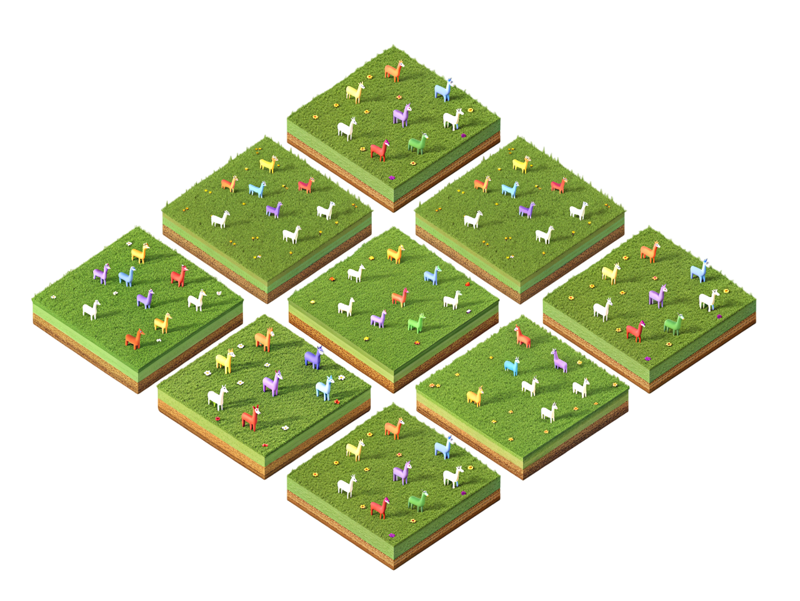

<div align="center">

  
  <h1>CyberAgentBreeder</h1>
  
  <p>
    CyberAgentBreeder: Mitigating the AI Safety Impact of Multi-Agent Scaffolds
  </p>
   
  
<!-- Badges -->
<p>
  <a href="https://github.com/J-Rosser-UK/CyberAgentBreeder/contributors">
    
  </a>
  <a href="">
    
  </a>
  <a href="https://github.com/J-Rosser-UK/CyberAgentBreeder/network/members">
    
  </a>
  <a href="https://github.com/J-Rosser-UK/CyberAgentBreeder/stargazers">
    
  </a>
  <a href="https://github.com/J-Rosser-UK/CyberAgentBreeder/issues/">
    
  </a>
  <a href="https://github.com/J-Rosser-UK/CyberAgentBreeder/blob/master/LICENSE">
    
  </a>
</p>
   
<h4>
    <!-- <a href="https://github.com/J-Rosser-UK/CyberAgentBreeder/">View Demo</a> -->
  <!-- <span> · </span> -->
    <a href="https://docs.google.com/presentation/d/197lRGAtPoG1NWLJ_fDOLTHBlyz9eA6G35g-XNvyb9To/edit?usp=sharing">Documentation</a>
  <span> · </span>
    <a href="https://github.com/J-Rosser-UK/CyberAgentBreeder/issues/">Report Bug</a>
  <span> · </span>
    <a href="https://github.com/J-Rosser-UK/CyberAgentBreeder/issues/">Request Feature</a>
  </h4>
</div>

<br />

 

## Abstract

Scaffolding Large Language Models (LLMs) into multi-agent scaffolds often improves performance on complex tasks, but the safety impact of such scaffolds has not been as thoroughly explored. In this paper, we introduce AGENTBREEDER a framework for multi-objective evolutionary search over scaffolds. Our REDAGENTBREEDER evolves scaffolds towards jailbreaking the base LLM while achieving high task success, while BLUEAGENTBREEDER instead aims to combine safety with task reward. We evaluate the scaffolds discovered by the different instances of AGENTBREEDER and popular baselines using widely recognized reasoning, mathematics, and safety benchmarks. Our work highlights and mitigates the safety risks due to multi-agent scaffolding.

## Directory Structure
```
CyberAgentBreeder/
  ├── README.md
  ├── Dockerfile
  ├── LICENSE
  ├── requirements.txt
  ├── .env.sample
  ├── .flake8
  ├── assets/
  │   └── source.txt
  └── src/
      ├── eval.py
      ├── main.py
      ├── base/
      │   ├── __init__.py
      │   ├── base.py
      │   ├── session.py
      │   └── tables.py
      ├── chat/
      │   ├── __init__.py
      │   ├── api.py
      │   ├── chat.py
      │   ├── test_api.py
      │   └── test_api_requests.py
      ├── descriptor/
      │   ├── __init__.py
      │   └── descriptor.py
      ├── evals/
      │   ├── __init__.py
      │   ├── arc.py
      │   ├── benchmark.py
      │   ├── clrs_text.py
      │   ├── drop.py
      │   ├── gpqa.py
      │   ├── metrics.py
      │   ├── mgsm.py
      │   ├── mmlu.py
      │   ├── test_arc.py
      │   ├── test_clrs_text.py
      │   ├── test_mmlu.py
      │   └── validator.py
      ├── generator/
      │   ├── __init__.py
      │   ├── generator.py
      │   └── mutator.py
      ├── illuminator/
      │   ├── __init__.py
      │   └── illuminator.py
      ├── prompts/
      │   ├── initial_population.py
      │   ├── mutation_base.py
      │   ├── mutation_prompts.py
      │   ├── mutation_reflexion.py
      │   └── utils.py
      └── visualizations/
          ├── tree.py
          └── visualizer.py

```

## Run with Docker
```
git clone https://github.com/J-Rosser-UK/CyberAgentBreeder

cd CyberAgentBreeder

sudo docker build -t agent_breeder .

sudo docker run -it agent_breeder

```


## Run directly
```
git clone https://github.com/J-Rosser-UK/CyberAgentBreeder

cd CyberAgentBreeder

cd src

python -m venv venv 

venv/Scripts/activate // windows

source venv/bin/activate // unix

pip install -r requirements.txt

### in a different terminal ###
python src/chat/api.py
###############################
 
python src/main.py --population_id None
```

