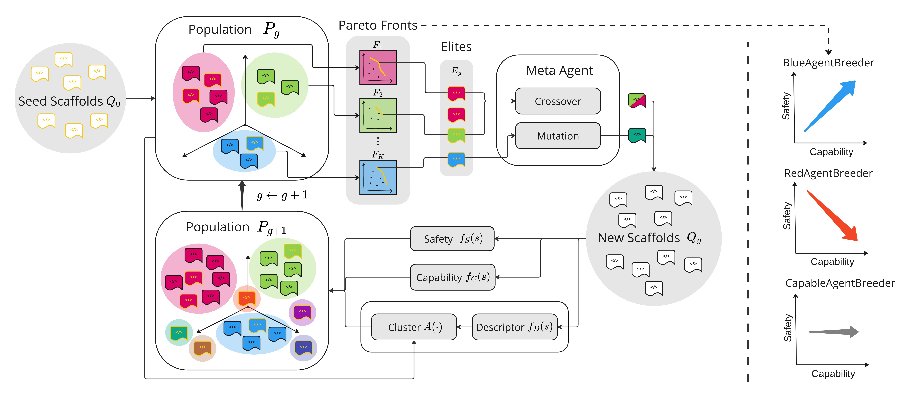

<div align="center">

  
  <h1>CyberAgentBreeder</h1>
  
  <p>
    CyberAgentBreeder: An Evolutionary Framework for Breeding LLM Cybersecurity Agents
  </p>
   
  
<!-- Badges -->
<p>
  <a href="https://github.com/J-Rosser-UK/CyberAgentBreeder/contributors">
    
  </a>
  <a href="">
    
  </a>
  <a href="https://github.com/J-Rosser-UK/CyberAgentBreeder/network/members">
    
  </a>
  <a href="https://github.com/J-Rosser-UK/CyberAgentBreeder/stargazers">
    
  </a>
  <a href="https://github.com/J-Rosser-UK/CyberAgentBreeder/issues/">
    
  </a>
  <a href="https://github.com/J-Rosser-UK/CyberAgentBreeder/blob/master/LICENSE">
    
  </a>
</p>
   
<h4>
    <!-- <a href="https://github.com/J-Rosser-UK/CyberAgentBreeder/">View Demo</a> -->
  <!-- <span> · </span> -->
    <a href="https://docs.google.com/presentation/d/197lRGAtPoG1NWLJ_fDOLTHBlyz9eA6G35g-XNvyb9To/edit?usp=sharing">Documentation</a>
  <span> · </span>
    <a href="https://github.com/J-Rosser-UK/CyberAgentBreeder/issues/">Report Bug</a>
  <span> · </span>
    <a href="https://github.com/J-Rosser-UK/CyberAgentBreeder/issues/">Request Feature</a>
  </h4>
</div>

<br />

 

## About

CyberAgentBreeder is an open-source research framework based on [AgentBreeder](https://github.com/J-Rosser-UK/AgentBreeder) that *evolves* multi-agent scaffolds powered by state-of-the-art Large Language Models (LLMs) to automatically solve cyber-security Capture-the-Flag (CTF) challenges.

This work was carried out by J Rosser as part of the UK AI Security Institute (AISI) Bounty Programme supervised by Joe Skinner.

The system maintains a *population* of autonomous agent scaffolds (each scaffold is a small Python program decorated with an `@solver` entry-point).  At every generation it:

1. **Mutates or cross-breeds** high-performing scaffolds to create offspring (see `src/discover`).
2. **Embeds and clusters** scaffolds in a latent descriptor space (see `src/descriptor`).
3. **Validates** new candidates against a benchmark such as *Intercode-CTF* (see `src/evals`).
4. **Illuminates the search space** via age-layered elites + hierarchical clustering.

Over successive generations the population converges on diverse, high-quality strategies for conquering increasingly difficult CTF tasks – entirely without manual prompt engineering.


## Features

+ ⚙️ *Evolutionary optimisation* (crossover + domain-specific mutation operators).
+ 🤖 *Multi-agent scaffolds* with React-and-Plan, Meta-GPT, Agent-Verse and more included in `src/seed`.
+ 📊 *Automated evaluation* with confidence intervals, stored in a local SQLite DB for easy analysis.

<br/>

## Quick start

### 1. Clone & install

```bash
git clone https://github.com/J-Rosser-UK/CyberAgentBreeder.git
cd CyberAgentBreeder
python -m venv .venv && source .venv/bin/activate
pip install -r requirements.txt
```

### 2. Configure API keys

CyberAgentBreeder relies on external LLM providers.  Create a `.env` file (or export vars) containing e.g.

```env
OPENAI_API_KEY="sk-..."
ANTHROPIC_API_KEY="claude-..."  # if using Anthropic models
```

### 3. Run your first experiment

```bash
python src/main.py \
  --n_generation 5            # number of evolutionary iterations
  --n_mutations 20            # offspring per generation
  --benchmark intercode_ctf   # or your own Benchmark class
```

Logs, database and artefacts will be written to `src/logs/` and `src/db/cyber.db`.

### 4. Resume / inspect

To resume the **last** population evaluated on a benchmark:

```bash
python src/main.py --population_id last --benchmark intercode_ctf
```

The SQLite database can be opened in your favourite viewer or directly from a notebook for analysis.


## Repository layout

```text
src/
  base/        # ORM, DB initialisation & population helpers
  descriptor/  # Embedding + clustering of scaffolds
  discover/    # Evolutionary operators & prompt templates
  evals/       # Benchmarks, metrics & task validators
  seed/        # Hand-crafted first-generation agent scaffolds
  main.py      # Orchestrates the evolutionary loop
assets/        # Logos + architecture diagram
```

## Benchmarks

| Benchmark | Description |
|-----------|-------------|
| `intercode_ctf` | A curated set of CTF challenges executed in Docker sandboxes (see `src/evals/intercode_ctf`). |

Adding your own benchmark is as easy as subclassing `evals.benchmark.Benchmark` and registering it with `@register_benchmark`.

## Citation

```bibtex
@misc{cyberagentbreeder2024,
  title  = {CyberAgentBreeder: Evolving Multi-Agent LLM Scaffolds for Cyber-Security},
  author = {J Rosser and Joe Skinner},
  year   = {2025},
  howpublished = {\url{https://github.com/J-Rosser-UK/CyberAgentBreeder}}
}
```


## License

CyberAgentBreeder is released under the terms of the MIT license.  See the [LICENSE](LICENSE) file for details.

